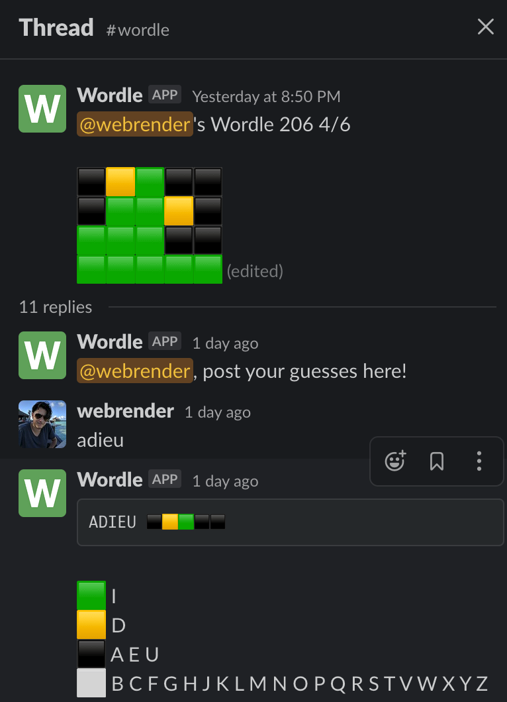

# slack-wordle

Wordle for Slack! This slack bot downloads the official Wordle bundle from https://www.powerlanguage.co.uk/wordle/ and executes it in a VM, delivering the results directly to your slack client.  It looks like this:

**This app stopped working once the NY Times started publishing a new bundle. I have yet to fix it.**
